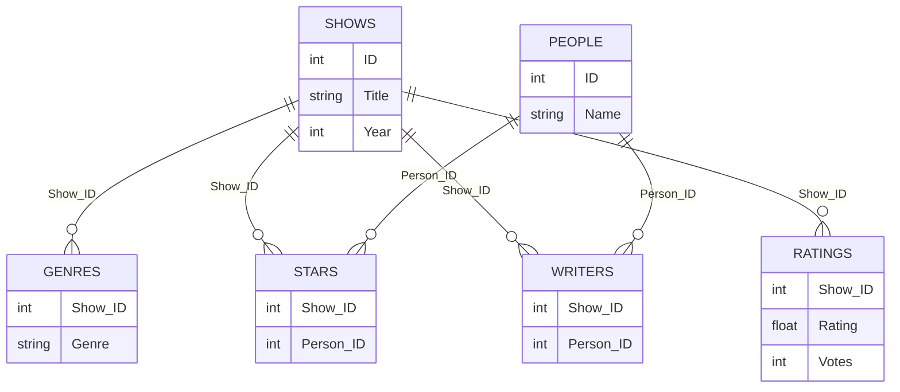

# Design Practice

## Shows database schema

```mermaid
erDiagram
    SHOWS {
        int ID
        string Title
        int Year
    }
    PEOPLE {
        int ID
        string Name
    }
    GENRES {
        int Show_ID
        string Genre
    }
    STARS {
        int Show_ID
        int Person_ID
    }
    WRITERS {
        int Show_ID
        int Person_ID
    }
    RATINGS {
        int Show_ID
        float Rating
        int Votes
    }

    SHOWS ||--o{ GENRES : "Show_ID"
    SHOWS ||--o{ STARS : "Show_ID"
    SHOWS ||--o{ WRITERS : "Show_ID"
    SHOWS ||--o{ RATINGS : "Show_ID"
    PEOPLE ||--o{ STARS : "Person_ID"
    PEOPLE ||--o{ WRITERS : "Person_ID"
```
